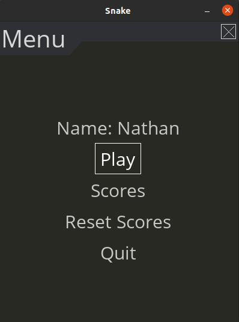
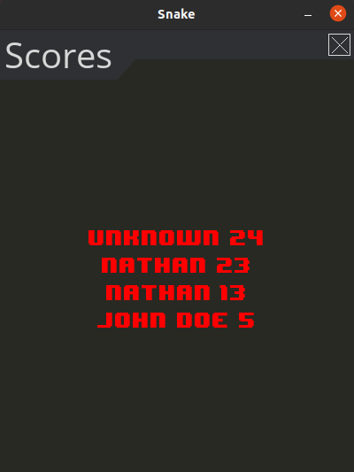
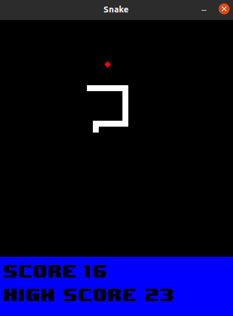

# Snake
Snake game using `pygame` and `pygame-menu`
## The game, menu and scores
The main menu is made with `pygame-menu` you can either play, see the currents scores, or reset all the scores.\
\
The 10th highest (or less) scores are saved using `pickle` and you can see them by pressing on the Scores button:\
\
Finally you can play the game by pressing on the Play button (eventually after entering you name so that there isn't any unknown player in the scores)\


## Dependencies
Install dependencies:
```
pip3 install -r requirements.txt
```
